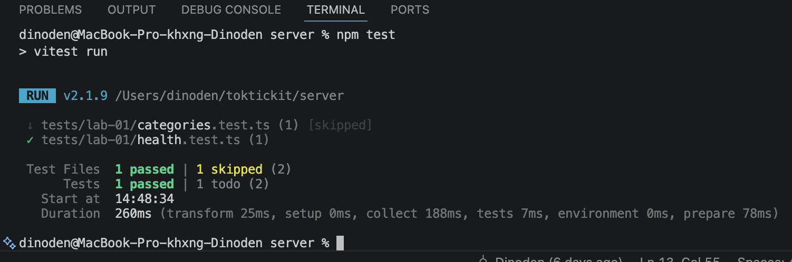
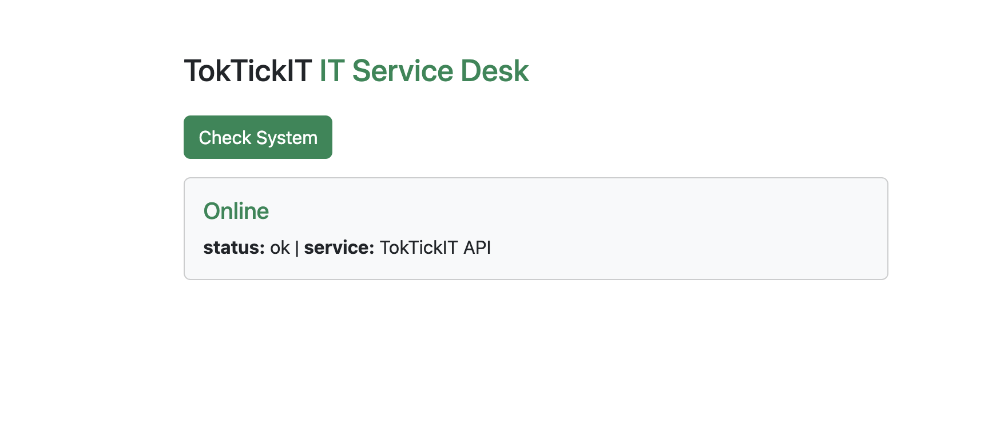

# Lab 1 — Test Plan and Evidence  (fill this in)

All test files live under server/tests/lab-01/ and client/tests/lab-01/.

| # | Tool | Test | Result |
|---|------|------|--------|
| 1 | Supertest | GET /api/health returns 200, status=ok | Pass |
| 2 | Supertest | GET /api/categories returns 4 seeded categories in id order | Pass |
| 3 | Vitest | Heading renders | Pass |
| 4 | Vitest | Success state shows Online + category list | Pass |
| 5 | Vitest | Error state shows Offline + message | Pass |

Paste your passing terminal output / screenshot below.

1. issue 2
 , 
2. issue 4

